# **WEB STACK IMPLEMENTATION (LEMP STACK)**

LEMP stands for
(Linux, Nginx, MySQL, PHP or Python, or Perl)

In this project you will implement a similar stack as in [project-1](https://github.com/Tobyumeh01/Project-1), but with an alternative Web Server – NGINX, which is also very popular and widely used by many websites in the Internet

## STEP 0 – *PREPARING PREREQUISITIES*

- create a new instance for project 2 and ssh into the instance

## STEP 1 - *INSTALLING THE NGINX WEB SERVER*

In order to display web pages to our site visitors, we are going to employ Nginx, a high-performance web server. We’ll use the apt package manager to install this package

- To Update your Package Repository run the command below:

`sudo apt update`

- To install Nginx run the command below:

`sudo apt install nginx`

you should get this below;
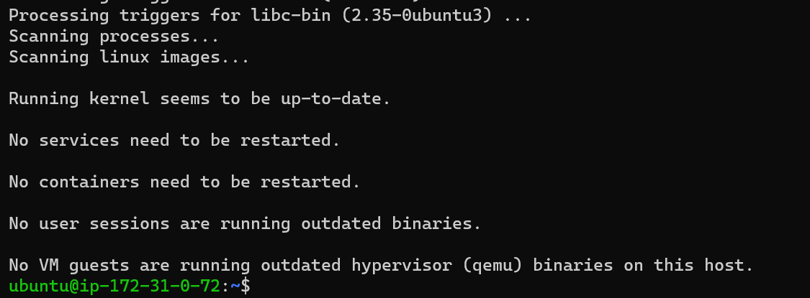

- To verify that nginx was successfully installed and is running as a service in Ubuntu, run:

`sudo systemctl status nginx`

the result is;
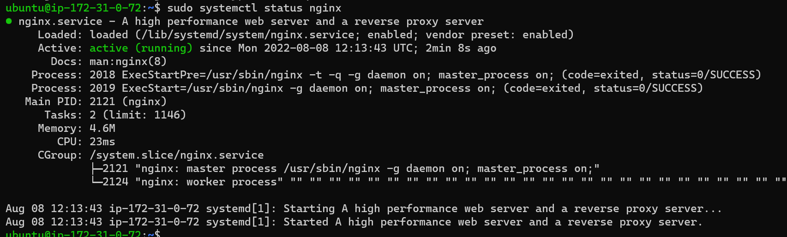

- add a rule to EC2 configuration to open inbound connection through port 80
- After that, Our server is running and we can access it locally and from the Internet (Source 0.0.0.0/0 means ‘from any IP address’).

- to access it locally in our Ubuntu shell, run:

`curl http://localhost:80`

the result is;
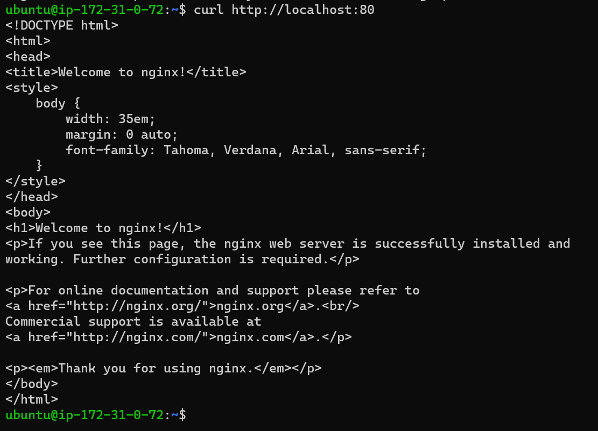

- to test how our Nginx server can respond to requests from the Internet, Open any web browser  and try to access following url;

`http://<Public-IP-Address>:80`

the result is;
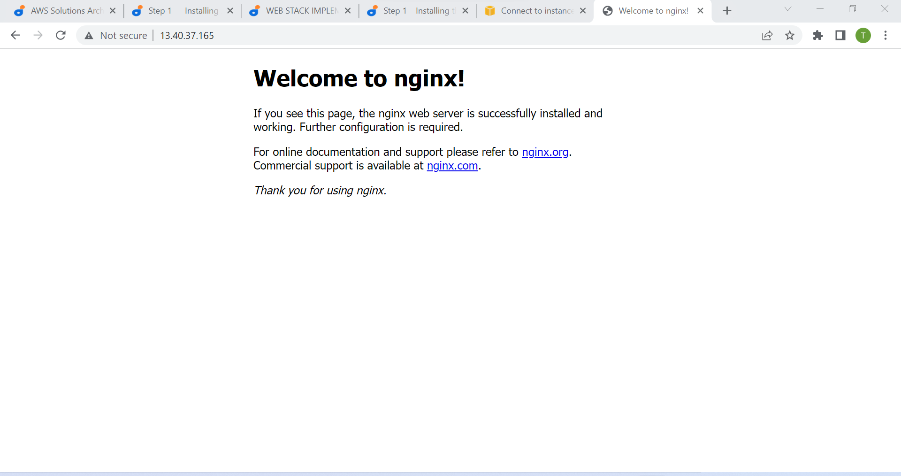

## STEP 2 — *INSTALLING MYSQL*

MySQL is a popular relational database management system used within PHP environments

- Run the command below to install mysql:

`$ sudo apt install mysql-server`

- When the installation is finished, log in to the MySQL console by typing:

`$ sudo mysql`

- This will connect to the MySQL server as the administrative database user root, which is inferred by the use of sudo when running this command. You should see output like this:
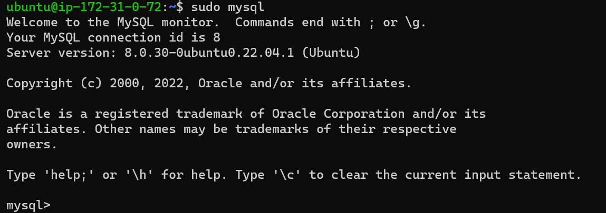

- Before running the script you will set a password for the root user, using:

`mysql_native_password`

- Exit the MySQL shell with:

`mysql> exit`

- Start the interactive script by running:

`$ sudo mysql_secure_installation`

- This will ask if you want to configure the VALIDATE PASSWORD PLUGIN.

- Answer Y for yes, or anything else to continue without enabling.

- When you’re finished, test if you’re able to log in to the MySQL console by typing:

`$ sudo mysql -p`

the result is;
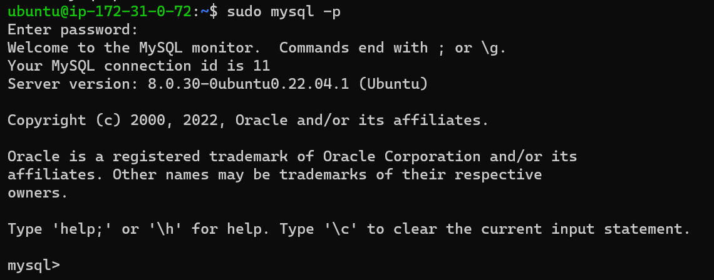

- To exit the MySQL console, type:

`mysql> exit`

## STEP 3 – *INSTALLING PHP*

While Apache embeds the PHP interpreter in each request, Nginx requires an external program to handle PHP processing and act as a bridge between the PHP interpreter itself and the web server. This allows for a better overall performance in most PHP-based websites, but it requires additional configuration. You’ll need to install php-fpm, which stands for “PHP fastCGI process manager”, and tell Nginx to pass PHP requests to this software for processing. Additionally, you’ll need php-mysql, a PHP module that allows PHP to communicate with MySQL-based databases. Core PHP packages will automatically be installed as dependencies.

- To install these 2 packages at once, run:

`sudo apt install php-fpm php-mysql`

the result is;
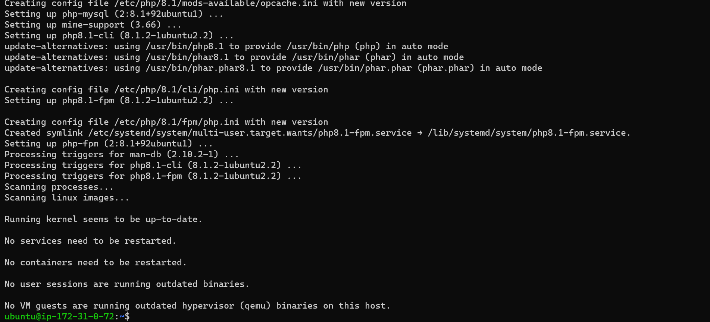

- When prompted, type Y and press ENTER to confirm installation.

## STEP 4 — *CONFIGURING NGINX TO USE PHP PROCESSOR*

 When using the Nginx web server, we can create server blocks (similar to virtual hosts in Apache) to encapsulate configuration details and host more than one domain on a single server. In this guide, we will use projectLEMP as an example domain name.

 On Ubuntu 20.04, Nginx has one server block enabled by default and is configured to serve documents out of a directory at /var/www/html. While this works well for a single site, it can become difficult to manage if you are hosting multiple sites. Instead of modifying /var/www/html, we’ll create a directory structure within /var/www for the your_domain website, leaving /var/www/html in place as the default directory to be served if a client request does not match any other sites.

- Create the root web directory for your_domain using:

`sudo mkdir /var/www/projectLEMP`

- to assign ownership of the directory with the $USER environment variable, which will reference your current system user:

`sudo chown -R $USER:$USER /var/www/projectLEMP`

- open a new configuration file in Nginx’s sites-available directory using your preferred command-line editor. Here, we’ll use nano:

`sudo nano /etc/nginx/sites-available/projectLEMP`

- This will create a new blank file. Paste in the following bare-bones configuration:

#/etc/nginx/sites-available/projectLEMP

server {
    listen 80;
    server_name projectLEMP www.projectLEMP;
    root /var/www/projectLEMP;

    index index.html index.htm index.php;

    location / {
        try_files $uri $uri/ =404;
    }

    location ~ \.php$ {
        include snippets/fastcgi-php.conf;
        fastcgi_pass unix:/var/run/php/php8.1-fpm.sock;
     }

    location ~ /\.ht {
        deny all;
    }

}

- Activate your configuration by linking to the config file from Nginx’s sites-enabled directory:

`sudo ln -s /etc/nginx/sites-available/projectLEMP /etc/nginx/sites-enabled/`

- This will tell Nginx to use the configuration next time it is reloaded. You can test your configuration for syntax errors by typing:

`sudo nginx -t`

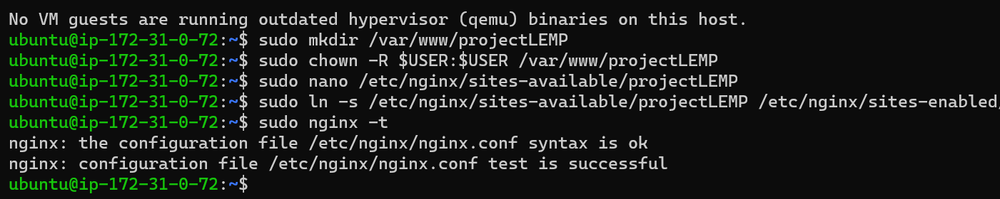

- to disable default Nginx host that is currently configured to listen on port 80, for this run:

`sudo unlink /etc/nginx/sites-enabled/default`

- reload Nginx to apply the changes:

`sudo systemctl reload nginx`

- the new website is now active, but the web root /var/www/projectLEMP is still empty. Create an index.html file in that location so that we can test that your new server block works as expected:

sudo echo 'Hello LEMP from hostname' $(curl -s http://169.254.169.254/latest/meta-data/public-hostname) 'with public IP' $(curl -s http://169.254.169.254/latest/meta-data/public-ipv4) > /var/www/projectLEMP/index.html

- Now go to your browser and try to open your website URL using IP address:

`http://<Public-IP-Address>:80`

the result is ;
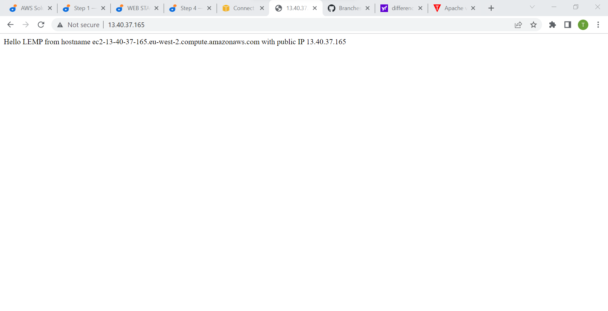

## STEP 5 – *TESTING PHP WITH NGINX*

Your LEMP stack should now be completely set up.

At this point, your LAMP stack is completely installed and fully operational.

You can test it to validate that Nginx can correctly hand .php files off to your PHP processor.

- You can do this by creating a test PHP file in your document root. Open a new file called info.php within your document root in your text editor:

`sudo nano /var/www/projectLEMP/info.php`

- Type or paste the following lines into the new file. This is valid PHP code that will return information about your server:

`<?php
phpinfo();`

- You can now access this page in your web browser by visiting the domain name or public IP address you’ve set up in your Nginx configuration file, followed by /info.php:

`http://`server_domain_or_IP`/info.php`

-  a web page containing detailed information about your server:
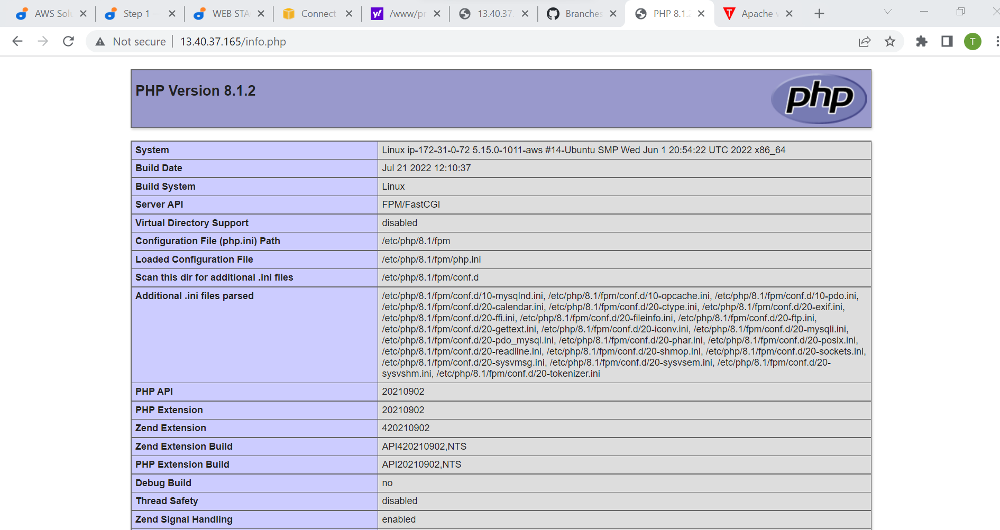

- The screenshot above contains sensitive information of your environment. So it is standard practice to remove it. Run the command below
`sudo rm /var/www/your_domain/info.php`

## STEP 6 – *RETRIEVING DATA FROM MYSQL DATABASE WITH PHP (CONTINUED)*

In this step you will create a test database (DB) with simple "To do list" and configure access to it, so the Nginx website would be able to query data from the DB and display it.

- First, connect to the MySQL console using the root account:

`sudo mysql`

- To create a new database, run the following command from your MySQL console:

`mysql> CREATE DATABASE `example_database`;`

the result is;
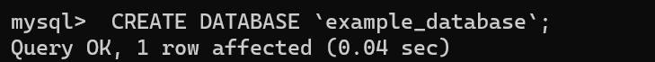

- To Create a user and password run the command below:

`mysql>  CREATE USER 'example_user'@'%' IDENTIFIED WITH mysql_native_password BY 'password';`

- Now we need to give this user permission over the example_database database:

`mysql> GRANT ALL ON example_database.* TO 'example_user'@'%';`

- To exit mysql as root user, run the command below:

`mysql> exit`

- You can test if the new user has the proper permissions by logging in to the MySQL console again, this time using the custom user credentials:

`mysql -u example_user -p`

- After logging in to the MySQL console, confirm that you have access to the example_database database:

`mysql> SHOW DATABASES;`

the output is;
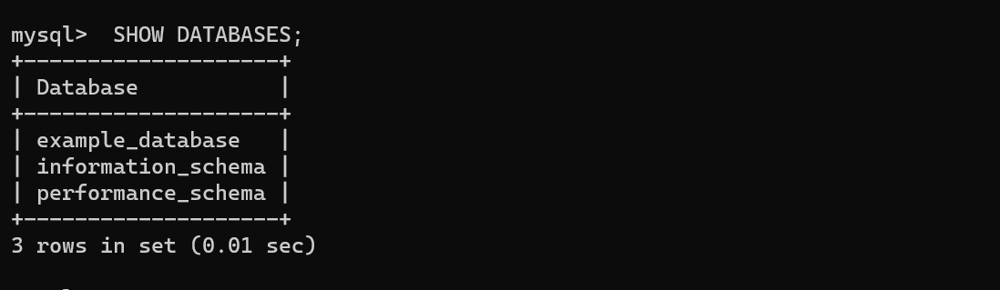

- Next, we’ll create a test table named todo_list. From the MySQL console, run the following statement:

`CREATE TABLE example_database.todo_list (
mysql>     item_id INT AUTO_INCREMENT,
mysql>     content VARCHAR(255),
mysql>     PRIMARY KEY(item_id)
mysql> );`

- Insert a few rows of content in the test table. You might want to repeat the next command a few times, using different VALUES:

`mysql> INSERT INTO example_database.todo_list (content) VALUES ("My first important item");`

- To confirm that the data was successfully saved to your table, run:

`mysql>  SELECT * FROM example_database.todo_list;`

- You’ll see the following output:
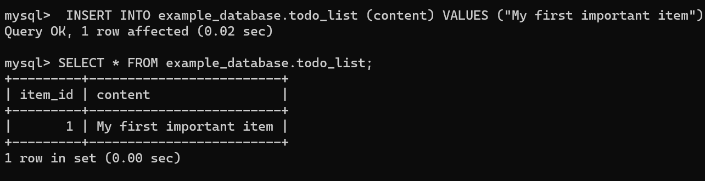

- After confirming that you have valid data in your test table, you can exit the MySQL console:

`mysql> exit`

- Create a new PHP file in your custom web root directory using your preferred editor. We’ll use vi for that:

`nano /var/www/projectLEMP/todo_list.php`

- Paste the text below into the blank file:

`<?php
$user = "example_user";
$password = "password";
$database = "example_database";
$table = "todo_list";

try {
  $db = new PDO("mysql:host=localhost;dbname=$database", $user, $password);
  echo "<h2>TODO</h2><ol>";
  foreach($db->query("SELECT content FROM $table") as $row) {
    echo "<li>" . $row['content'] . "</li>";
  }
  echo "</ol>";
} catch (PDOException $e) {
    print "Error!: " . $e->getMessage() . " ";
    die();
}`

- Save and close the file when you are done editing.

- You can now access this page in your web browser by visiting the domain name or public IP address configured for your website, followed by /todo_list.php:

`http://<Public_domain_or_IP>/todo_list.php`

the result is;
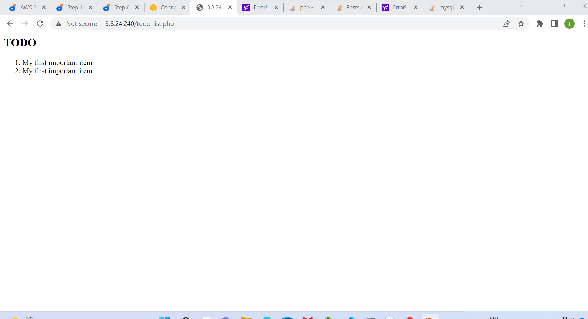
